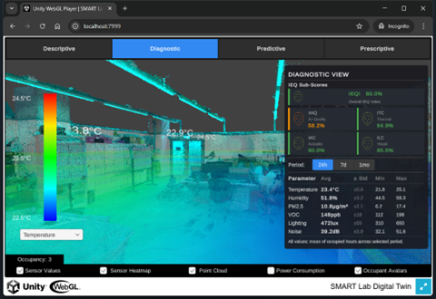
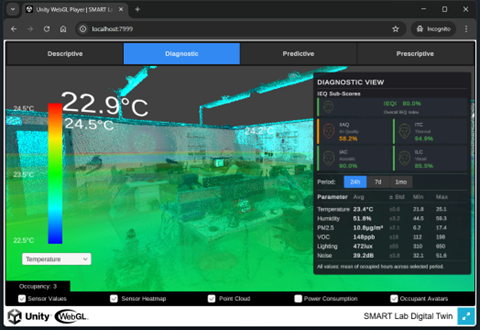
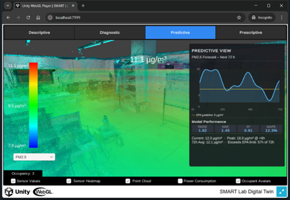
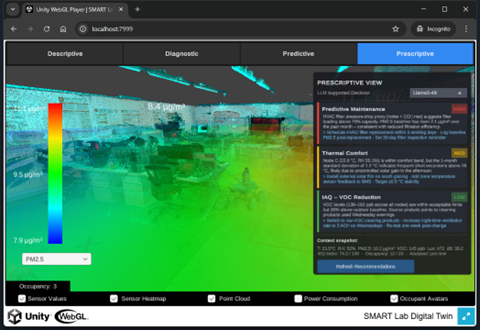

# Multi-Layer Digital Twin Platform for Indoor Environmental Quality: A Containerized Approach

## Overview

This repository provides the implementation supporting a containerized Digital Twin (DT) platform that delivers four progressive analytics layers for Indoor Environmental Quality (IEQ) management:

| Layer | Analytics | Question Answered |
|-------|-----------|-------------------|
| 1 | **Descriptive** | What is happening? — real-time monitoring and visualization |
| 2 | **Diagnostic** | Why is it happening? — statistical pattern recognition and anomaly detection |
| 3 | **Predictive** | What will happen? — ML-based environmental parameter forecasting |
| 4 | **Prescriptive** | What should we do? — LLM-generated contextualized recommendations |

The platform is validated through production deployment at a university campus (NYUAD Experimental Research Building) for IEQ monitoring, integrating IoT sensors, time-series databases, machine learning inference, and large language model services — all encapsulated as independently deployable Docker containers.

## Platform Architecture

Each analytics layer is isolated as an independent container service, enabling:
- Modular deployment (deploy only the layers you need)
- Per-layer empirical benchmarking of CPU, memory, and energy consumption
- Progressive scaling from basic monitoring to AI-driven decision support

**Key services per layer:**

- **Descriptive** — IoT data ingestion, dashboard, time-series database
- **Diagnostic** — Statistical analysis engine (avg ± std, min/max over 24h/7d/1mo)
- **Predictive** — Machine learning inference service (PM2.5 72-hour forecast)
- **Prescriptive** — Local LLM service generating maintenance and comfort recommendations

## Analytics Views

The WebGL-based 3D Digital Twin interface exposes each analytics layer as a dedicated tab.

### Layer 1 — Descriptive View
Real-time sensor heatmap overlaid on the 3D point cloud, with live parameter values (temperature, humidity, PM2.5, VOC, lighting, noise) per sensor node.

### Layer 2 — Diagnostic View
Statistical summary table for all IEQ parameters across selectable time periods (24h / 7d / 1mo), alongside IEQ sub-scores and overall IEQ score.

### Layer 3 — Predictive View
72-hour PM2.5 forecast line chart with model performance metrics (RMSE, MAE, R², MAPE) and EPA threshold alerts.

### Layer 4 — Prescriptive View
LLM-supported decision cards covering predictive maintenance, thermal comfort, and IAQ/VOC reduction, with a one-click refresh to rotate recommendation sets.

## Performance Summary

Empirical benchmarking on a local server shows computational demands scale with analytics complexity:

| Layer | CPU Utilization | Memory | Energy |
|-------|----------------|--------|--------|
| Descriptive | ~3.7% | ~10% | ~17 W |
| Diagnostic | moderate | moderate | moderate |
| Predictive | higher | higher | higher |
| Prescriptive | ~51% | ~40% | ~55 W |

